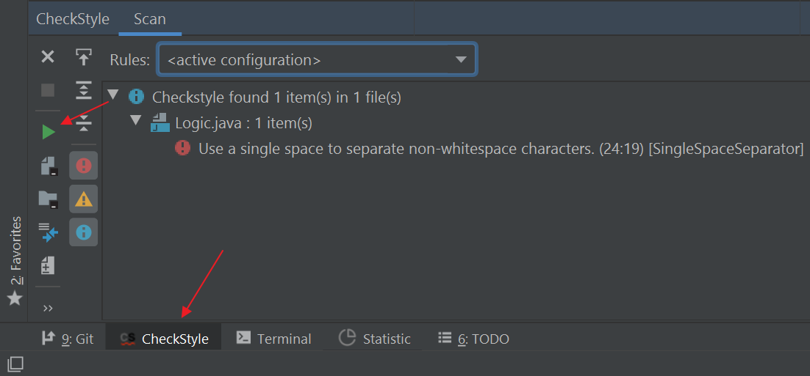

<frontmatter>
  title: "Using Checkstyle"
  pageNav: 2
</frontmatter>

# Using Checkstyle

<div class="lead">

Checkstyle is a static analysis tool that can check Java code against a set of style rules.
</div>

Given below are some instructions on how to use Checkstyle for some common project tasks.

## Using Checkstyle with Gradle

Here is an example of relevant lines that should be in the `build.gradle` file.

```groovy {highlight-lines="2,6-8", heading="build.gradle"}
plugins {
    id 'checkstyle'
    // other plugins
}

checkstyle {
    toolVersion = '8.1'
}
```

Some relevant Gradle _tasks_ added by the CheckStyle plugin.
* `checkstyleMain`: checks if the main code complies with the style rules
* `checkstyleTest`: checks if the test code complies with the style rules

For example, you can run `gradlew checkstyleMain checkstyleTest` to verify that all your code complies with the style rules.

## Using Checkstyle-IDEA plugin

Given below are the steps to install the Checkstyle-IDEA plugin so that Intellij can alert you about code style problems as you write code.

1. Install the Checkstyle-IDEA plugin by going to `File` \> `Settings` (Windows/Linux), or `IntelliJ IDEA` \> `Preferences…​` (macOS). Select `Plugins`, press `Browse Repository`, and find the plugin. Restart the IDE to complete the installation.

1. Click `File` \> `Settings…​` \> `Other Settings` \> `Checkstyle`

1. Set `Scan Scope` to `Only Java sources (including tests)`, so that the plugin will run checkstyle for our test source codes as well

1. Ensure that the `Checkstyle version` is set to the one used by the project.<br>
{{ icon_tip }} If your project uses Gradle, you can check the `build.gradle` file to find the correct version.<br>
   

1.  Click the plus sign under `Configuration File`

1.  Enter an arbitrary description e.g. addressbook

1.  Select `Use a local Checkstyle file`

1.  Use the checkstyle configuration file found at `config/checkstyle/checkstyle.xml`

1.  Click `Next` \> `Finish`

1. Mark `Active` for the newly imported check configuration<br>
  

1. Click `OK`

1. To verify the plugin is set up correctly, temporirily modify the code to violate a style rule (e.g., add an extra space somewhere) and run the Checkstyle check using the plugin.<br>
   

#### Troubleshooting

**Problem: When importing `checkstyle.xml`, Checkstyle-IDEA plugin complains that `The Checkstyle rules file could not be parsed. …​ The file has been blacklisted for 60s.`**
* Reason: `checkstyle.xml` is written for a particular version, but the plugin was not configured to the correct version.
* Solution: Ensure that you have selected the correct `Checkstyle
    version` that matches the version in `build.gradle` and have clicked
    `Apply`, as `checkstyle.xml` is written for Gradle’s checkstyle.

**Problem: After setting up `checkstyle.xml`, Checkstyle-IDEA plugin does not seem to highlight the errors / real-time scanning seems broken.**
* Reason: The plugin may not immediately run after setting it up.
* Solution: Restart the IDE.

## Configuring Checkstyle rules

Checkstyle expects configuration files for checkstyle (e.g., files that specify which style rules to follow) to be in `./config/checkstyle/` by convention.

The set of code style rules are put in the `config/checkstyle/checkstyle.xml`. To enable *exceptions* to code styles, you can add in the comment `//CODESTYLE.OFF: RuleName` at the start of the section and `//CODESTYLE.ON: RuleName` at the end of the section. Alternatively, you can specify which rules to suppress in a config file `config/checkstyle/suppressions.xml`

## Resources

* [Checkstyle home page](https://checkstyle.sourceforge.io/)