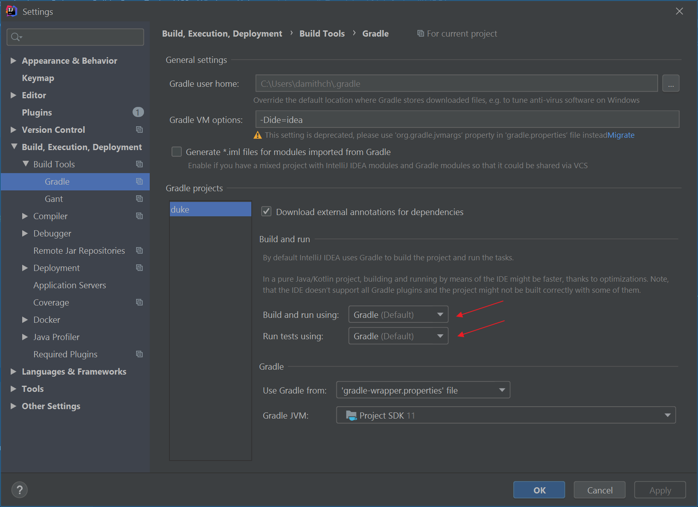

<frontmatter>
  title: "Gradle Tutorial"
  pageNav: 2
</frontmatter>

# Gradle Tutorial

Gradle is a _build automation tool_ used to automate build processes. There are many ways of integrating Gradle into a project. This tutorial uses the _Gradle wrapper_ approach.

* [Basics](#basics)
* [Adding Gradle to the project](#adding-gradle-to-the-project)
* [Running Gradle tasks](#running-gradle-tasks)
* [Adding plugins](#adding-plugins)
* [Using Gradle to do some common project activities](#using-gradle-to-do-some-common-project-activities)
  * [Running CheckStyle](#running-checkstyle)
  * [Running tests](#running-tests)
  * [Creating a JAR file](#creating-a-jar-file)
* [Managing dependencies](#managing-dependencies)
* [Further reading](#further-reading)

## Basics

You use a _build file_ (named `build.gradle`) to describes the project to Gradle. A build file mainly consists of _plugins_, _tasks_ and _properties_. 

* **Plugins** extend the functionality of Gradle. For example, the `java` plugin adds support for `Java` projects.

* **Tasks** are reusable blocks of logic. For example, the task `clean` simply deletes the project build directory. 
Tasks can be composed of, or dependent on, other tasks. 

* **Properties** change the behavior of tasks. For instance, `mainClassName` of the `application` plugin is a compulsory property which tells Gradle which class is the entry point to your application. As Gradle favors [_convention over configuration_](https://en.wikipedia.org/wiki/Convention_over_configuration), there is not much to you need to configure if you follow the recommended directory structure.


## Adding Gradle to the project

****Scenario 1:**** You are setting up a project in Intellij IDEA. The project already has Gradle support.

<div class="ml-3">

{{ icon_tip }} If the project comes with Gradle support, you will see a `build.gradle` file in your project root.
</div>

1. When you _import_ the project into IDEA, at the step where you normally select the project root folder, choose the `build.gradle` file inside the root folder instead.
1. If asked, choose `Open as Project` (not `Open as File`).
1. After importing is complete, you will see the `Gradle Toolbar` in the IDEA interface.<br>
   

****Scenario 2:**** You are adding Gradle support to an ongoing project that is already set up in Intellij IDEA. Gradle wrapper files have been provided.

1. Add the Gradle wrapper files to the project. e.g., if they are in a separate branch, merge that branch.
1. Close the IDEA project if it is open.
1. Delete the `.idea` folder.
1. Import the project again (similar to scenario 1 above)

****Scenario 3:**** You are adding Gradle support to an ongoing project from scratch.

* You are on you own but [this](https://docs.gradle.org/current/userguide/gradle_wrapper.html) is a good place to start.


## Using Gradle in Intellij IDEA


If the Gradle tasks don't appear in the Gradle window, click the 'refresh' button in the tooolbar to reimport the Gradle project.

Intellij uses Gradle to run your application by default. If you would like to run the project in the normal way, go to `File` > `Settings` and change the following settings:<br>

 

## Running Gradle Tasks

To run a task, locate the task in the Gradle toolbar, right-click on a task, and choose `run`.

Alternatively, you can type the command in the terminal.

* On Windows: `gradlew <task1> <task2> …`​ e.g. `gradlew clean test`
* On Mac/Linux: `./gradlew <task1> <task2> …`​ e.g. `./gradlew clean test`


## Adding plugins

Gradle plugins are reusable units of build logic. Most common build tasks are bundled into core plugins provided by Gradle. Java, CheckStyle, and Shadow are three of plugins commonly used in Java projects.
The relevant lines of the `build.gradle` are given below:

```groovy
plugins {
    id 'java'
    id 'application'
    id 'checkstyle'
    id 'com.github.johnrengelman.shadow' version '5.1.0'
}
```

## Using Gradle to do some common project activities

### Running CheckStyle

CheckStyle is a tool for checking if the code complies with certain style rules.

Checkstyle expects configuration files for checkstyle (e.g., files that specify which style rules to follow) to be in `./config/checkstyle/` by convention.

The plugin adds a few _tasks_ to your project.
* `checkstyleMain`: checks if the main code complies with the style rules
* `checkstyleTest`: checks if the test code complies with the style rules

For example, you can run `gradlew checkstyleMain checkstyleTest` to verify that all your code complies with the style rules.

**Resources**:
* [Gradle documentation for the CheckStyle plugin](https://docs.gradle.org/current/userguide/checkstyle_plugin.html)


### Running tests

Run the `test` task to run the tests in the project.


**Resources**:
* [Gradle documentation for JUnit](https://docs.gradle.org/current/userguide/java_testing.html#using_junit5)


### Creating a JAR file

Shadow is a plugin that packages an application into an executable jar file. 

The plugin can be configured by setting some properties. By default, it produces a jar file with the name in the format of `{archiveBaseName}-{archiveVersion}.jar` (the two properties can be set in the `build.gradle` file).

You can generate an executable jar by running the command `gradlew shadowJar` which publishes an executable jar to `./build/libs/`.

**Resources**:
* [Gradle documentation for the Shadow plugin](https://plugins.gradle.org/plugin/com.github.johnrengelman.shadow)
* [More about the Shadow plugin](https://imperceptiblethoughts.com/shadow/introduction/)


## Managing dependencies

Gradle can automate the management of dependencies to third-party libraries. You just need to add the dependency into the `build.gradle` file and Gradle will do the rest. For example, here is how the JUnit library has been added to the dependencies in the `build.gradle`:
```groovy
dependencies {
    testImplementation group: 'org.junit.jupiter', name: 'junit-jupiter-api', version: '5.5.0'
}
```

For example, to add the Natty (a third-party library used for parsing natural lanaguage dates e.g., `today`), you simply have to add the following line to the `dependencies` section of the `build.gradle` file.
```groovy
compile group: 'com.joestelmach', name: 'natty', version: '0.6'
```

Tip: Most third-party libararies specify how to add it as a Gradle dependency ([example](https://mvnrepository.com/artifact/com.joestelmach/natty/0.6)).

## Further reading

* [Official Gradle Documentation](https://docs.gradle.org/current/userguide/userguide.html)

----------------------------------------------------------------------------------------
**Authors:**
* Initial Version: Jeffry Lum
