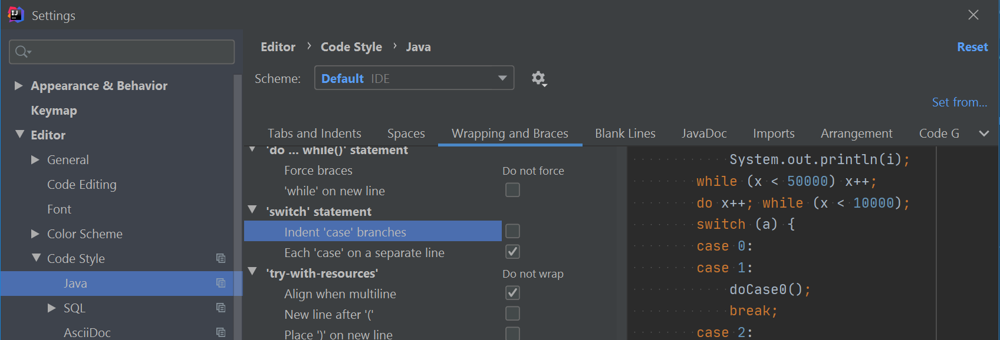
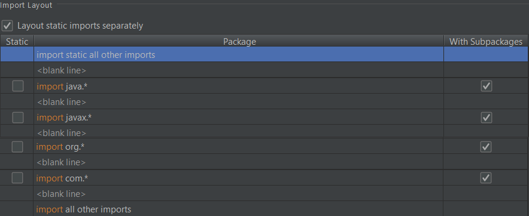

<frontmatter>
  title: "Intellij IDEA: Configuring the code style"
  pageNav: 2
</frontmatter>

# Intellij IDEA: Configuring the code style

IntelliJ’s default style is mostly compliant with [ours](../conventions/java/) but it uses a different import order from ours but some tweaks may be needed.

**Legend**: {{ icon_level_basic }} basic tweak | {{ icon_level_intermediate }} intermediate tweak | {{ icon_level_advanced }} advanced tweak

## Tweak: `switch-case` style {{ icon_level_basic }}

1. Go to `File` → `Settings…​` (Windows/Linux), or `IntelliJ IDEA` → `Preferences…​` (macOS).
1. Click on `Editor` → `Code style`→ `Java` (see the screenshot below). 
   
1. Click on the `Wrapping and Braces` tab and un-tick the `Indent 'case' branches` option (as shown in the screenshot above).

## Tweak: `import` order {{ icon_level_intermediate }}

1. Go to `File` → `Settings…​` (Windows/Linux), or `IntelliJ IDEA` → `Preferences…​` (macOS).
1. Select `Editor` → `Code Style` → `Java`.
1. Click on the `Imports` tab to set the import order.
   * For `Class count to use import with '*'` and `Names count to use static import with '*'`: Set to `999` to prevent IntelliJ from contracting the import statements.
   * For `Import Layout`: The order is: 
     

## Tweak: Auto-remove trailing spaces {{ icon_level_intermediate }}

You can configure Intellij to automatically strip trailing white space in code lines, as follows:
1. Go to `Settings`.
1. On the left side of the dialog, click on `Editor` -> `General`.
1. On the right side, scroll to the `On Save` section.
1. Change `Remove trailing spaces on:` to `Modified lines`.

## More useful settings {{ icon_level_advanced }}

The tweaks given above are specific to code style. A few more useful settings (not related to the code style) can be found [here](intellijUsefulSettings.md).
