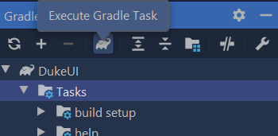

<frontmatter>
  title: "Intellij IDEA: Importing a Gradle project"
</frontmatter>

# Intellij IDEA: Importing a Gradle project

<box type="tip" seamless>

If the project comes with Gradle support, you will see a `build.gradle` file in your project root.
</box>

<box type="warning" seamless>

IntelliJ IDEA has the Gradle plugin installed by default.  If you have disabled it, go to `File` → `Settings` → `Plugins` to re-enable it. 
  If your project involves GUI programming, similarly ensure the JavaFX plugin has not been disabled.
</box>

1. Open Intellij.
1. if you are in the welcome screen, Click `Open`. Otherwise, click `File` -> `Open`. 
   i. Select the project directory, and click `OK`. 
   ii. If there are any further prompts, accept the defaults but do ensure that the selected version of `Gradle JVM` matches the JDK being used for the project.
1. After the importing of the project is complete (which could take a few minutes), you will see the `Gradle Toolbar` in the IDEA interface %%e.g., look for the elephant icon (on Windows, this appears on the right-edge of the IDE window) and click it%%. 
   

