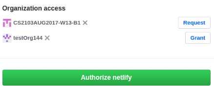
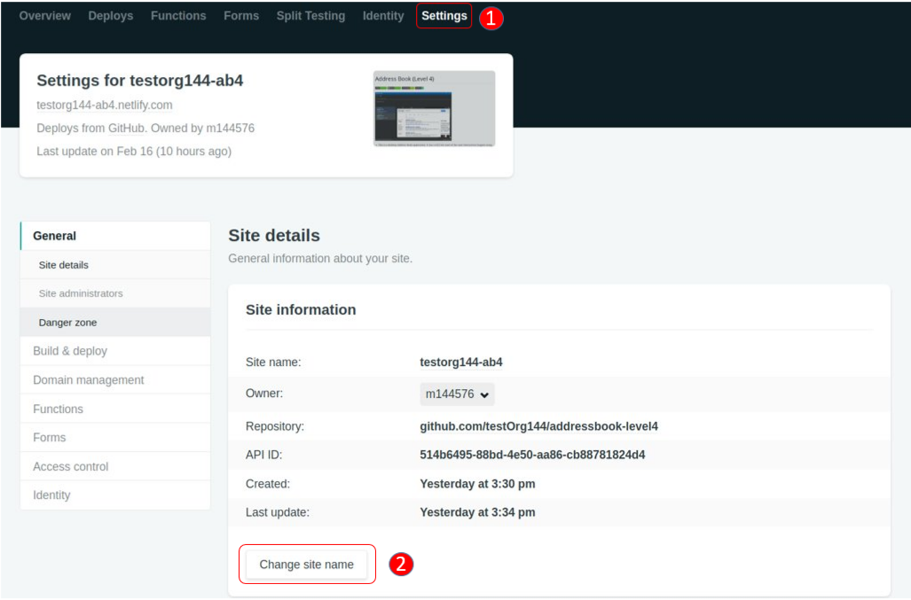

<frontmatter>
  title: "Using Netlify"
  pageNav: 3
</frontmatter>

# Using Netlify

**[Netlify](https://www.netlify.com/) is an automated hosting platform for deploying websites.** Its [_deploy previews_](https://www.netlify.com/blog/2016/07/20/introducing-deploy-previews-in-netlify/) feature is particularly useful for <tooltip content="i.e., how would the final output of the documentation will change if the PR is merged">previewing documentation changes in a PR</tooltip>.

The sections below explains how to use Netlify in a project.

<box type="important" seamless>

**Caution:** Netlify allows only 300 free build minutes per month. They use an unsavory practice of letting you exceed the limit silently and then sending you an invoice for the extra use. You will not be able to use Netlify again unless you pay (or get them to cancel the charge). Therefore, we caution you to use Netlify (if at all) during times you update documentation and only if you want to use Netlify _Deploy Previews_ to help review such PRs.

</box>

## Setting up

1. Go to https://www.netlify.com/ and click `Sign Up`. Next, click `GITHUB SIGN IN`, enter your GitHub account details and authorize netlify.

1. After logging in, click `New site from Git`.

1. You will then be brought to the setup page. Click `GitHub` to link your repository to Netlify.
   * Depending on whether you are the owner of the repository, you can either grant or request access to Netlify so that it can access your repository and build your documentation. 
    
   * After granting or requesting access to your repository, click `Authorize netlify`.

1. Pick your repository from the list.

1. Fill out the details as follows and then click `Deploy site`.
   * Branch to deploy: select `master` branch
   * If using Jekyll for project documentation:
     * Build command: `cd docs && bundle install && bundle exec jekyll build`
     * Publish directory: `docs/_site`
   * If using MarkBind for project documentation:
     * Build Command: `cd docs && npm i markbind-cli -g && markbind build --baseUrl`
     * Publish directory: `docs/_site`

   <box type="info" seamless>

   For both Jekyll and MarkBind, omit the `cd docs &&` and `docs/` from the _build command_ and the _publish directory_ respectively if the documentation is in the root (i.e., not inside the `docs` folder).
   </box>

1. Once Netlify has completed building your project, you can now:
   * View your main branch’s deployed documentation on the site name given by Netlify (customizable as shown [below](#changing_the_site_name)). 
    
   * Preview the updated documentation whenever a pull request is made by clicking the `Details` hyperlink next to the Netlify test status. 
     

## Changing the site name

If you don’t like the site name given by Netlify, you can change it as follows:

1.  Click on `Settings`.

2.  Then click `Change site name` and fill in your desired site name. 
    
