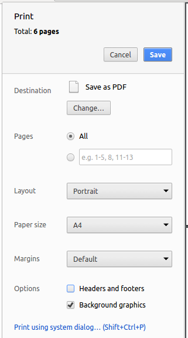

<frontmatter>
  title: "Saving web documents as PDF files"
</frontmatter>

# Saving web documents as PDF files


**Use Chrome (==<span class="text-danger">NOT any other Browser</span>==)** for converting documentation to PDF format.

<box type="info" seamless>

Reason: Chrome’s PDF engine preserves hyperlinks used in Web pages.
</box>

Here are the steps to convert the project documentation files to PDF format.
1. Go to your generated documentation site on GitHub using Chrome.
1. Within Chrome, click on the `Print` option in Chrome’s menu.
1. Set the destination to `Save as PDF`, then click `Save` to save a copy of the file in PDF format.<br>
   ==For best results, use the settings indicated in the screenshot below.==

   

<box type="tip" seamless>

**Adding a page break manually**{.text-success}

In some cases, you might want to force a page break at a certain point in the generated PDF file. In those case, you can do so by inserting the following into the corresponding place in your source file.

```html
<div style="page-break-after: always;"></div>
```
</box>
